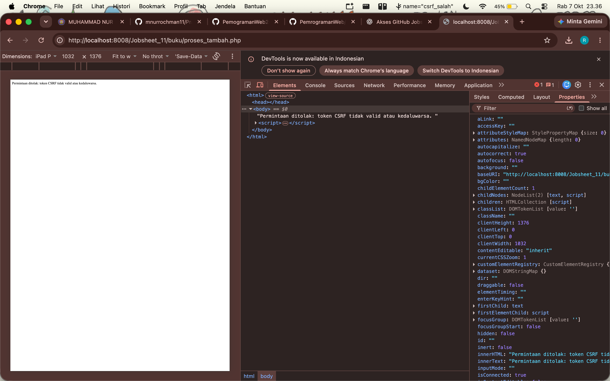
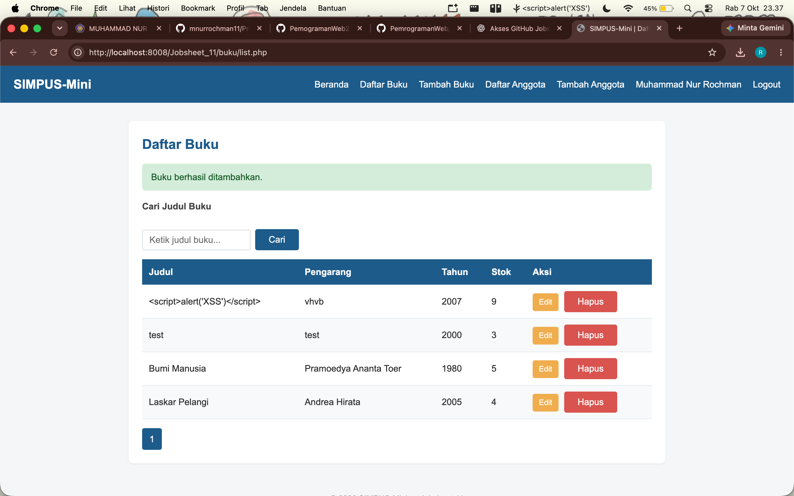
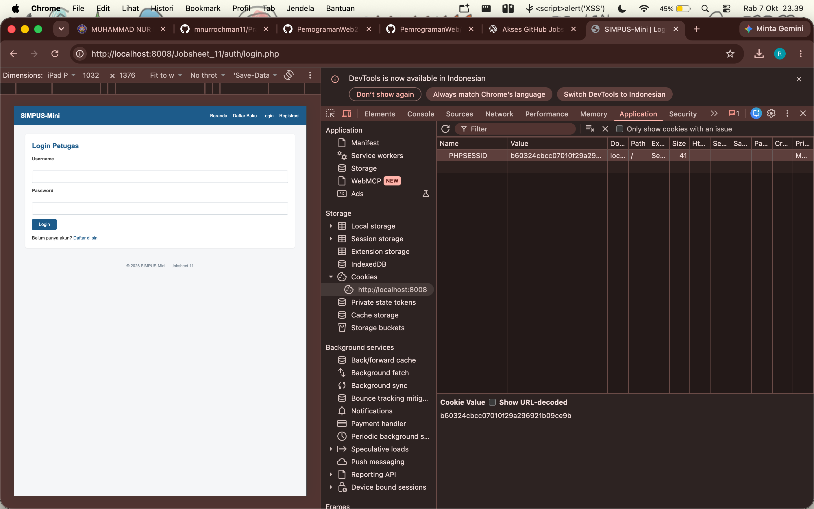
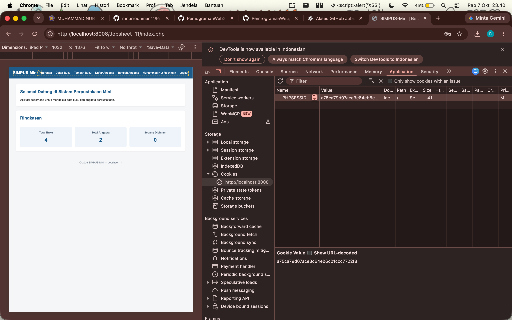
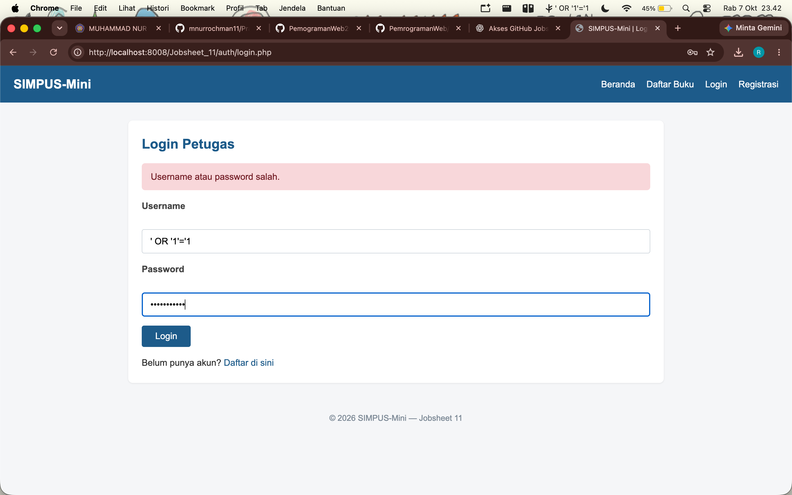

# Laporan Pemrograman Web

- **Nama:** Muhammad Nur Rochman
- **NIM:** 254107020121
- **Kelas:** TI-2G

---

## Jobsheet 11

1. **CSRF**

   Pengujian dilakukan dengan mengubah nama token CSRF pada form. Sistem menolak permintaan karena token tidak valid.

   

2. **XSS**

   Pengujian dilakukan dengan memasukkan kode ``. Kode tidak dijalankan sebagai JavaScript dan hanya tersimpan sebagai teks.

   

3. **Session Fixation**

   Nilai `PHPSESSID` dibandingkan sebelum dan sesudah login. Nilai session berubah setelah login sehingga session fixation dapat dicegah.

   

   

4. **SQL Injection**

   Pengujian dilakukan menggunakan input `' OR '1'='1`. Login gagal dan sistem tidak dapat dilewati menggunakan SQL Injection.

   

5. **Kesimpulan**

   Pada Jobsheet 11 dilakukan pengujian keamanan pada aplikasi SIMPUS-Mini. Pengujian CSRF, XSS, Session Fixation, dan SQL Injection berhasil dicegah oleh sistem.