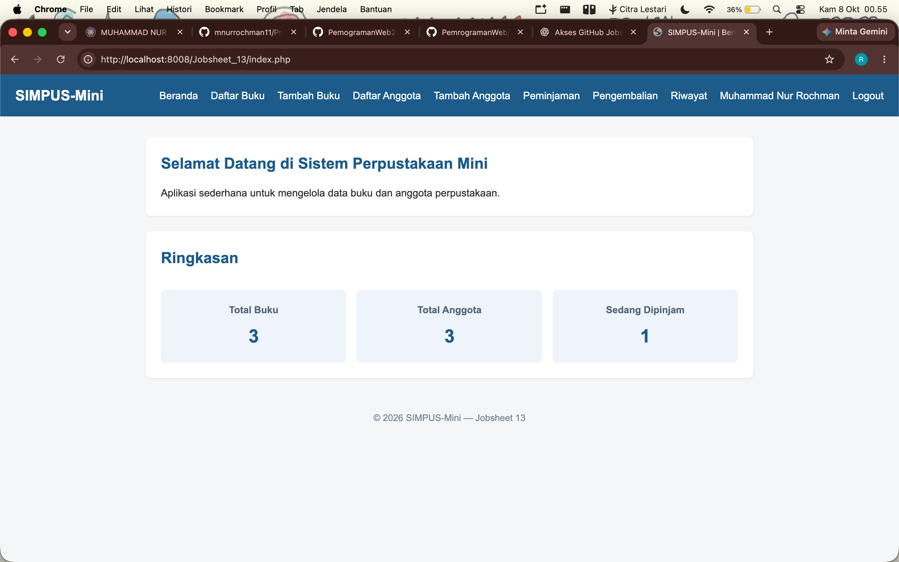
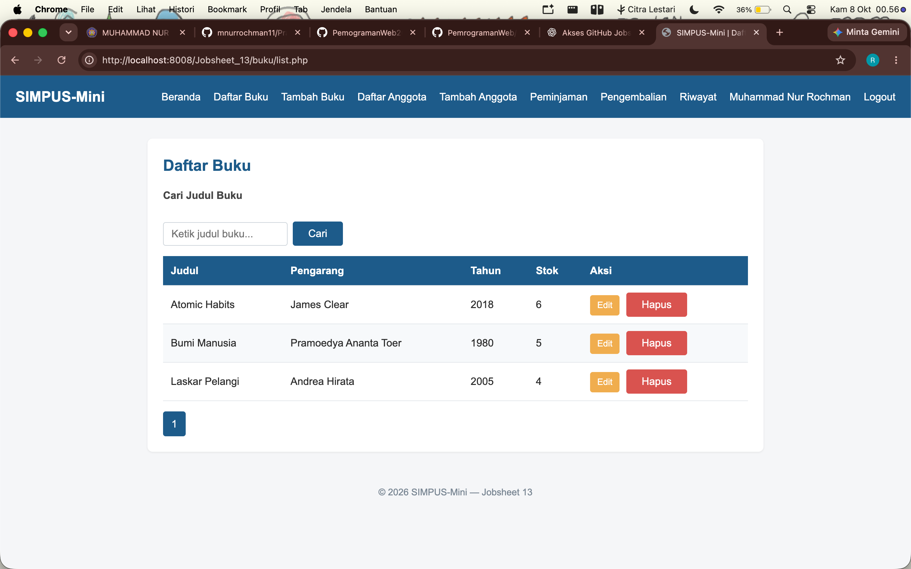
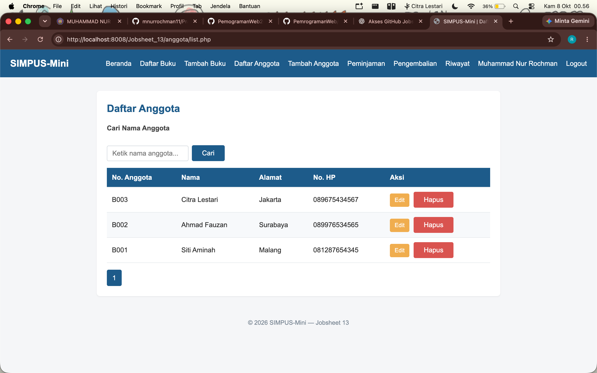
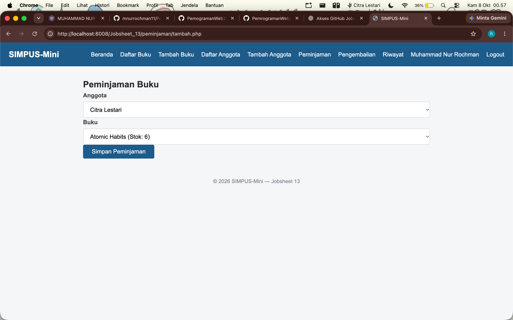
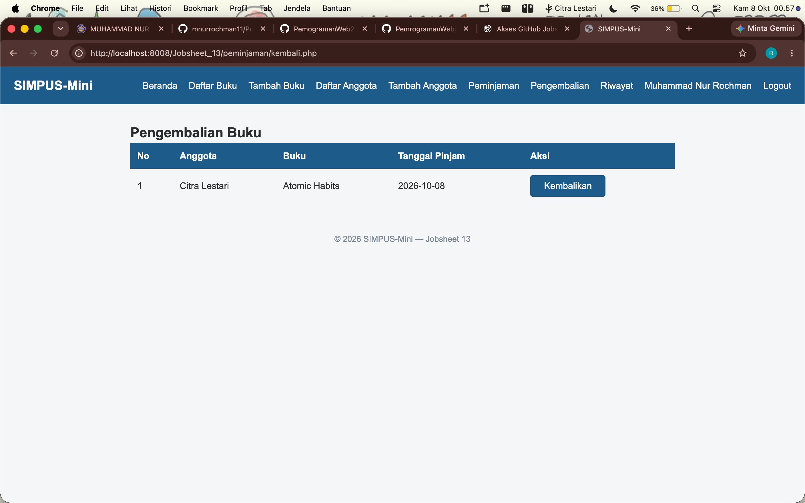
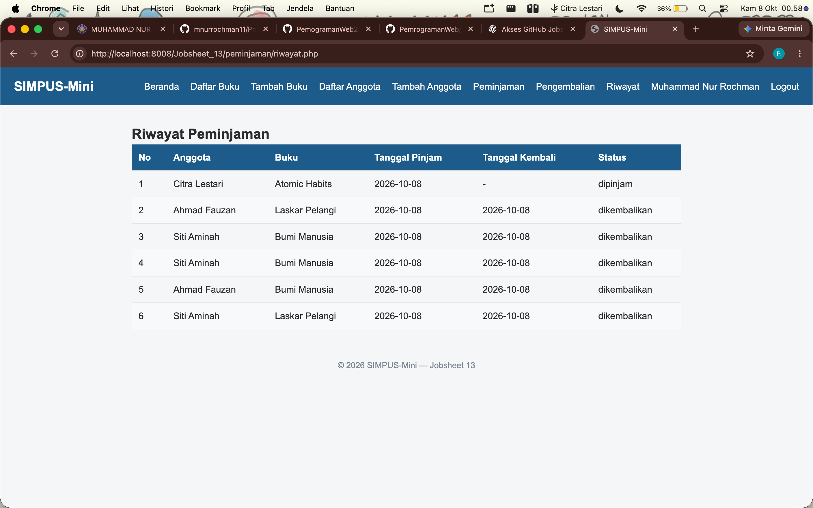

# Laporan Pemrograman Web

- **Nama:** Muhammad Nur Rochman
- **NIM:** 254107020121
- **Kelas:** TI-2G

---

## Jobsheet 13

### 1. Dashboard

Dashboard merupakan halaman utama petugas setelah berhasil login. Halaman ini menampilkan ringkasan informasi perpustakaan seperti jumlah buku, jumlah anggota, dan jumlah buku yang sedang dipinjam.

### 2. Daftar Buku

Halaman Daftar Buku digunakan untuk menampilkan data buku yang tersedia pada sistem perpustakaan. Petugas dapat melihat informasi buku dan mengelola data buku.

### 3. Daftar Anggota

Halaman Daftar Anggota digunakan untuk menampilkan data anggota perpustakaan. Data anggota dapat digunakan dalam proses peminjaman buku.

### 4. Peminjaman

Halaman Peminjaman digunakan untuk melakukan transaksi peminjaman buku. Petugas dapat memilih anggota dan buku yang tersedia untuk melakukan peminjaman.

### 5. Pengembalian

Halaman Pengembalian digunakan untuk memproses buku yang telah dikembalikan oleh anggota. Setelah pengembalian diproses, status transaksi berubah dan stok buku bertambah kembali.

### 6. Riwayat

Halaman Riwayat digunakan untuk menampilkan seluruh transaksi peminjaman yang telah dilakukan. Informasi yang ditampilkan meliputi anggota, buku, tanggal peminjaman, tanggal pengembalian, dan status transaksi.

### 7. Dokumentasi Aplikasi

Pada Jobsheet 13 dibuat dokumentasi aplikasi untuk membantu pengguna memahami struktur dan cara penggunaan SIMPUS-Mini. Dokumentasi terdiri dari `README.md` dan `docs/manual-pengguna.md`.

`README.md` berisi informasi umum mengenai aplikasi, fitur, struktur project, database, cara menjalankan aplikasi, serta keamanan sistem.

File `docs/manual-pengguna.md` berisi panduan penggunaan aplikasi mulai dari registrasi, login, pengelolaan buku dan anggota, peminjaman, pengembalian, melihat riwayat, hingga logout.

### 8. Konfigurasi Database

Pada Jobsheet 13 konfigurasi database dipisahkan ke dalam file `includes/config.php`. Konfigurasi tersebut digunakan oleh `includes/koneksi.php` untuk melakukan koneksi ke database PostgreSQL.

Pemisahan konfigurasi ini membuat pengaturan database lebih mudah disesuaikan ketika aplikasi dijalankan pada lingkungan yang berbeda.

### 9. Kesimpulan

Pada Jobsheet 13 dilakukan tahap akhir berupa persiapan dokumentasi dan konfigurasi aplikasi SIMPUS-Mini. Aplikasi telah dilengkapi dengan dokumentasi berupa README dan manual pengguna serta konfigurasi database yang lebih terstruktur. Seluruh fitur utama seperti pengelolaan buku, pengelolaan anggota, peminjaman, pengembalian, dan riwayat transaksi dapat digunakan dengan baik.