# Laporan Pemrograman Web

- **Nama:** Muhammad Nur Rochman
- **NIM:** 254107020121
- **Kelas:** TI-2G

---

## Jobsheet 8

1. **Beranda**
   
   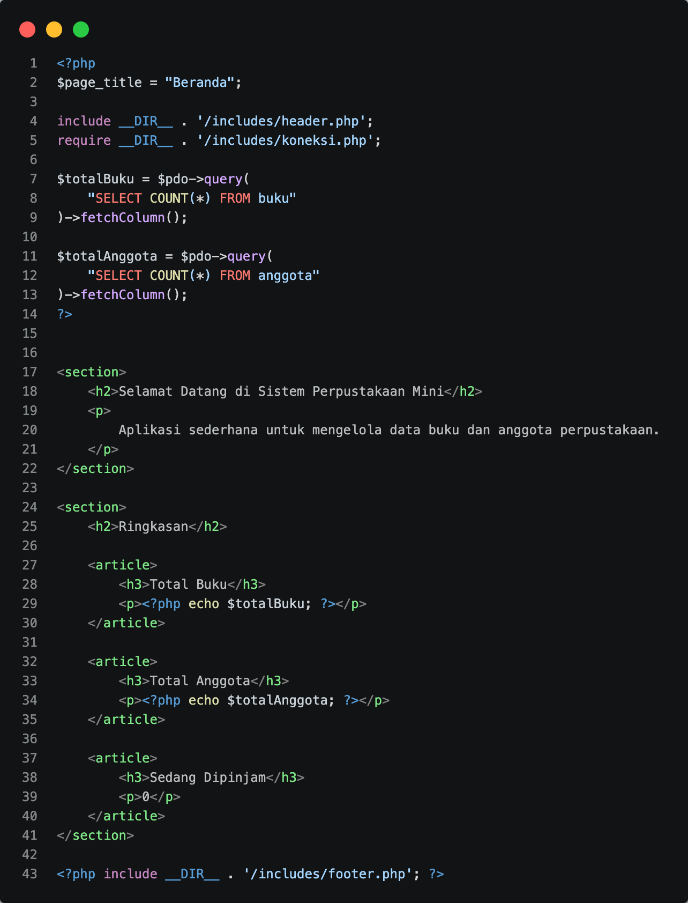

2. **List Anggota**
   
   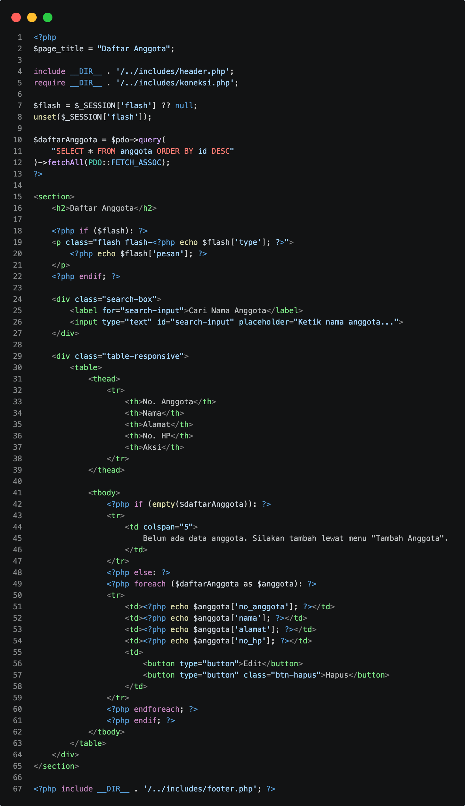

3. **List Buku**
   
   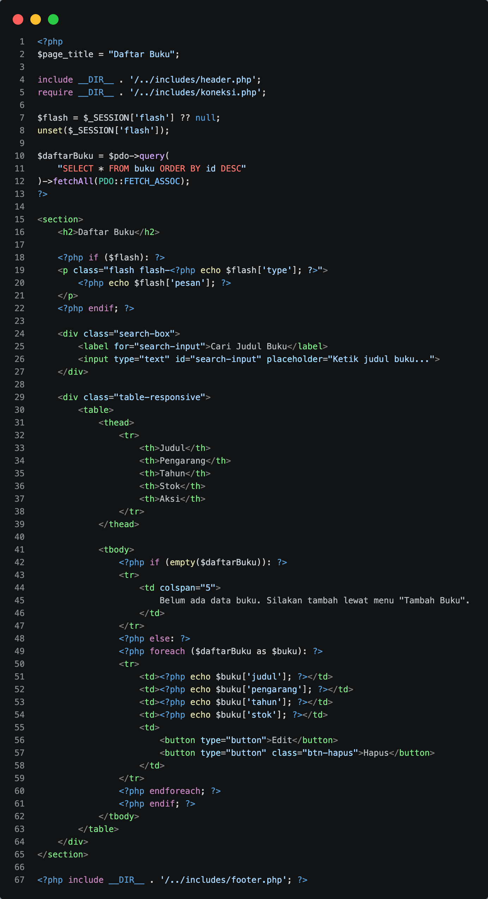

4. **Tambah Anggota**
   
   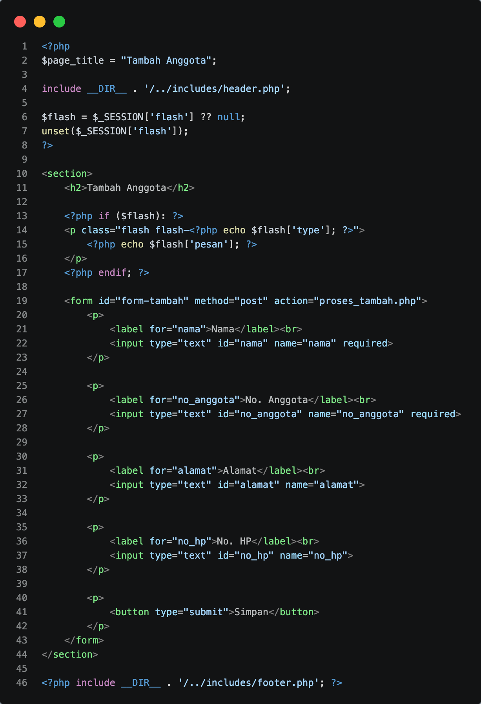

5. **Tambah Buku**
   
   

6. **Proses Tambah Anggota**
   
   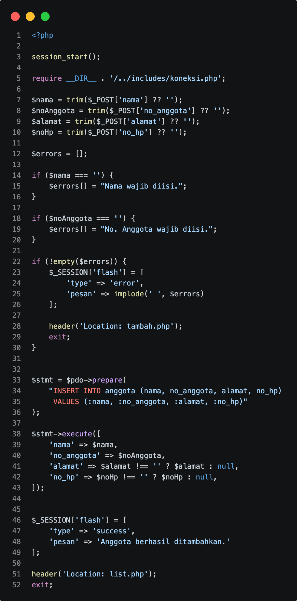

7. **Proses Tambah Buku**
   
   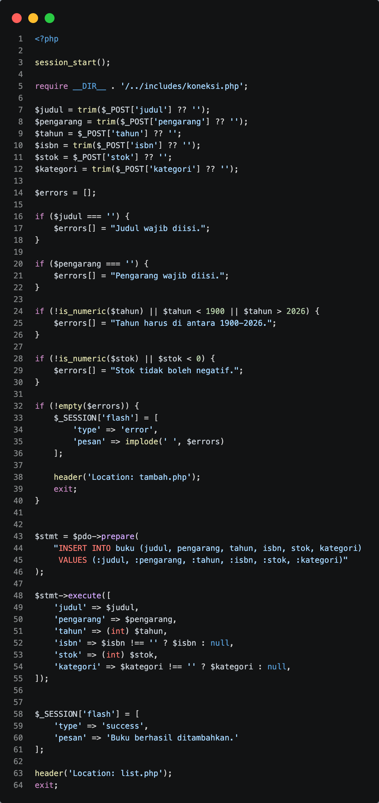

8. **Koneksi Database**
   
   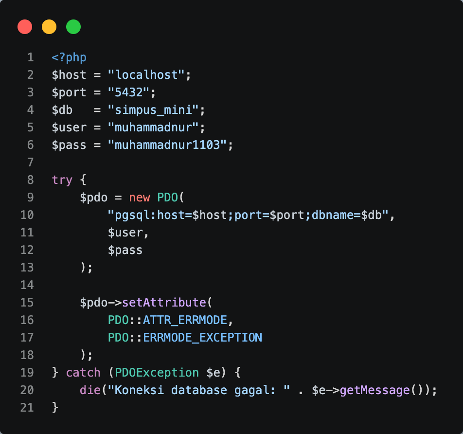

9. **Struktur Database**
   
   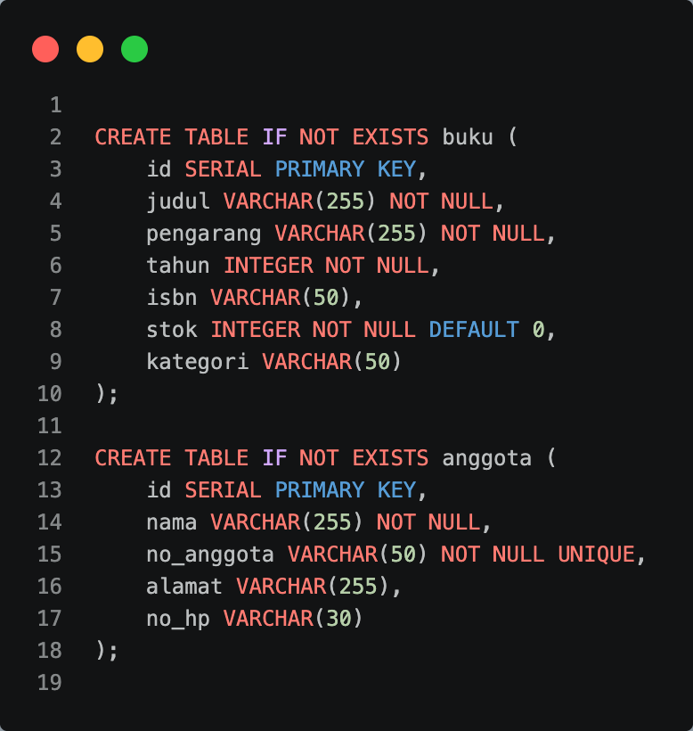

10. **Footer**
    
    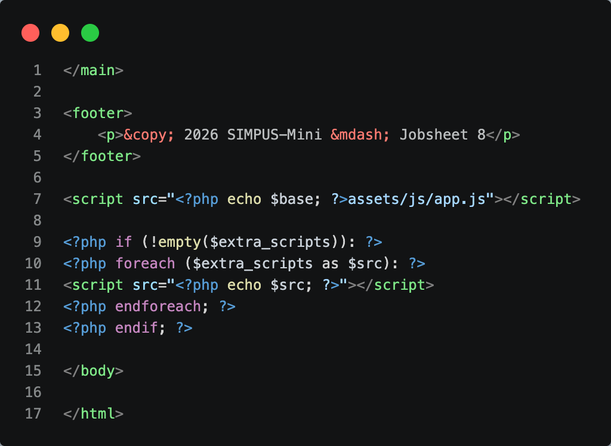

11. **Header**
    
    

12. **CSS**
    
    

13. **JS**
    
    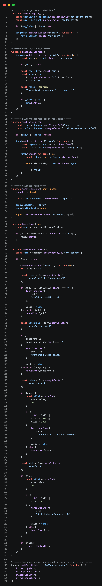
