# Laporan Pemrograman Web

- **Nama:** Muhammad Nur Rochman
- **NIM:** 254107020121
- **Kelas:** TI-2G

---

## Jobsheet 9

1. **List Anggota**
   
   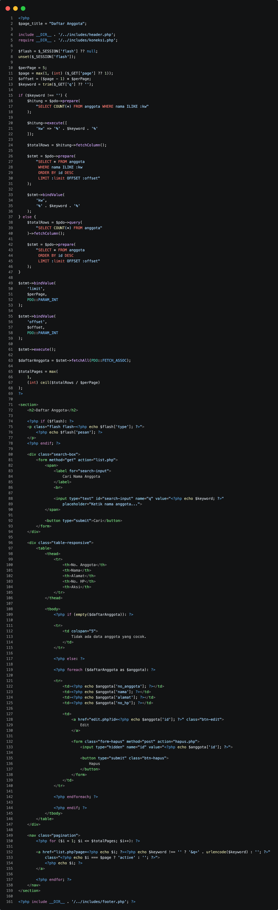

2. **Edit Anggota**
   
   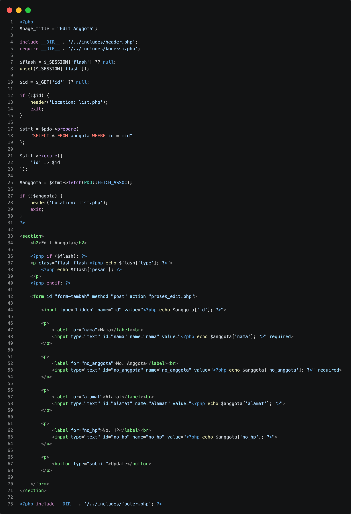

3. **Proses Edit Anggota**
   
   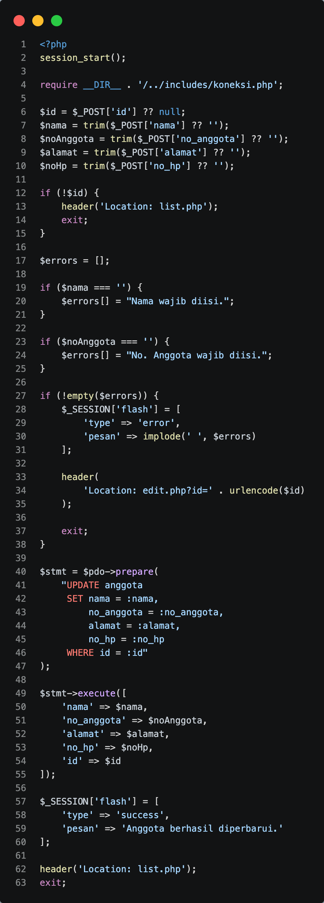

4. **Hapus Anggota**
   
   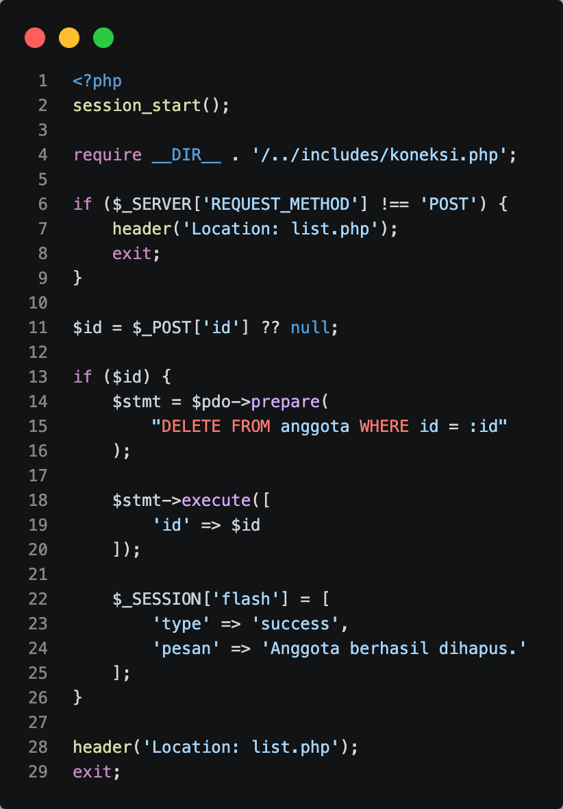

5. **List Buku**
   
   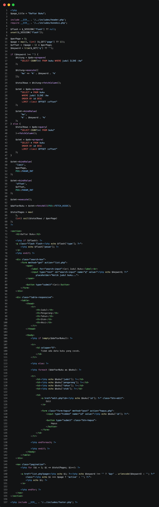

6. **Edit Buku**
   
   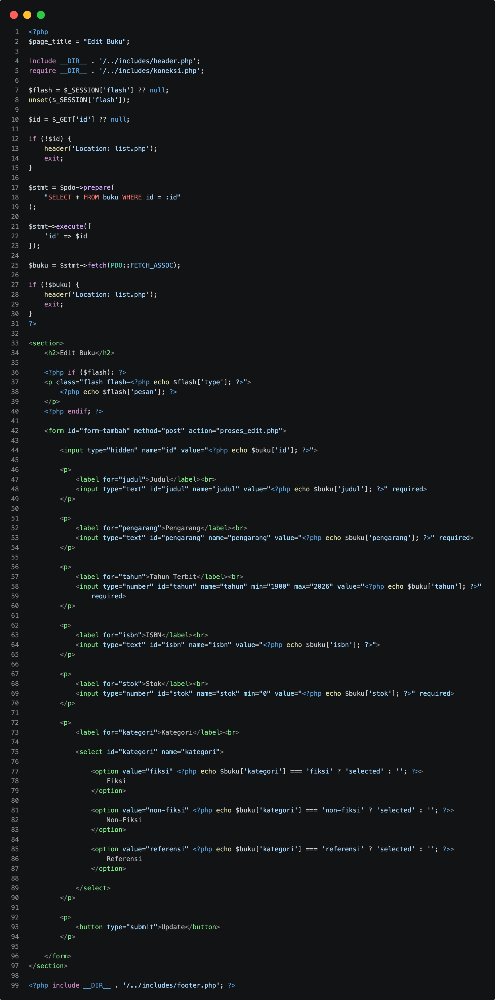

7. **Proses Edit Buku**
   
   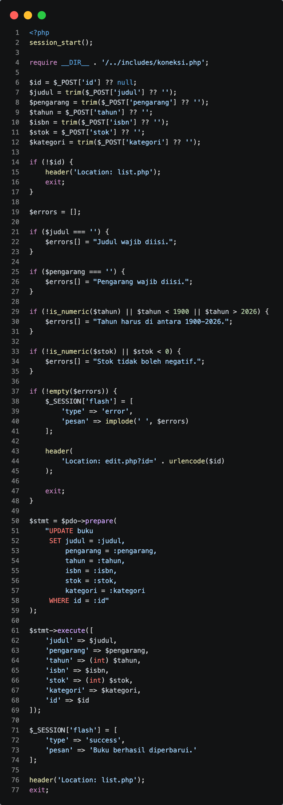

8. **Hapus Buku**
   
   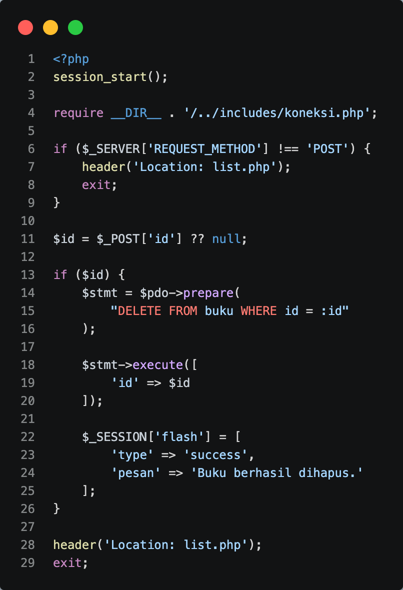

9. **CSS**
   
   

10. **JavaScript**
    
    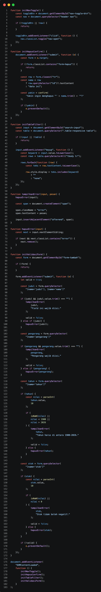

11. **Footer**
    
    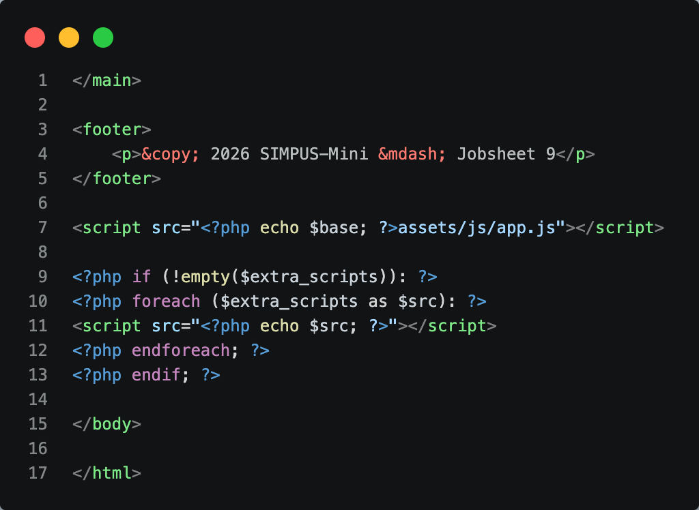